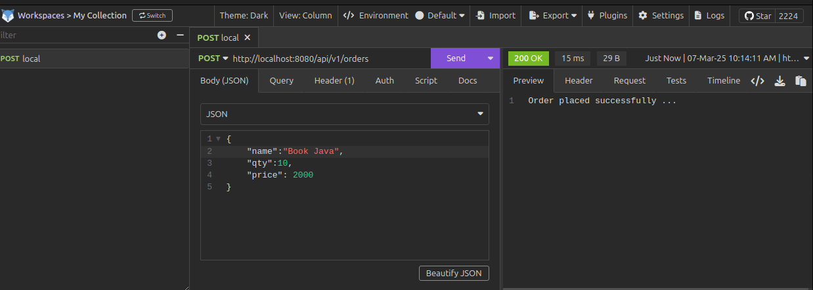
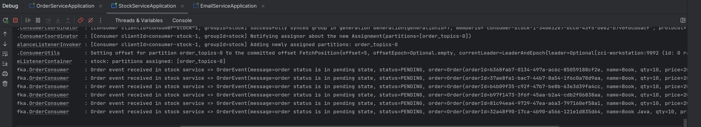
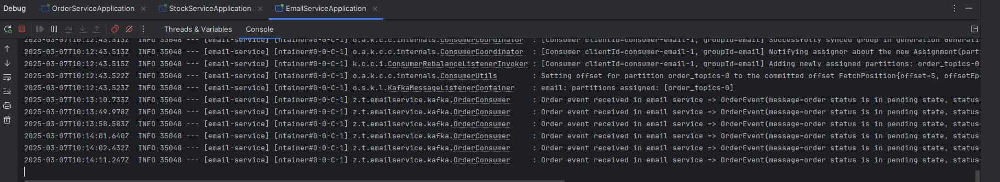

# Event-Driven Microservices using Spring Boot and Kafka

Event-driven architecture (EDA) is a software design pattern in which decoupled applications can asynchronously publish and subscribe to events via an event broker/message broker.

In an Event-Driven Architecture, applications communicate with each other by sending and/or receiving events or messages.

# Install and Setup Apache Kafka
Download kafka from https://kafka.apache.org/downloads

start the Zookeeper service:

    # Start the ZooKeeper service
    # Note: Soon, ZooKeeper will no longer be required by Apache Kafka.
    $ bin/zookeeper-server-start.sh config/zookeeper.properties`

Start Kafka Broker

Open another terminal session and run the below command to start the Kafka broker:
    
    # Start the Kafka broker service
    $ bin/kafka-server-start.sh config/server.properties

# 4 Microservices - OrderService, StockService, EmailService, and Base-Domains

Configure Kafka Producer and Consumer and controller test...

maven dep: 

        <dependency>
			<groupId>org.springframework.kafka</groupId>
			<artifactId>spring-kafka</artifactId>
		</dependency>

# Run 3 Microservices 

Demo :  REST API call to send an Order:

